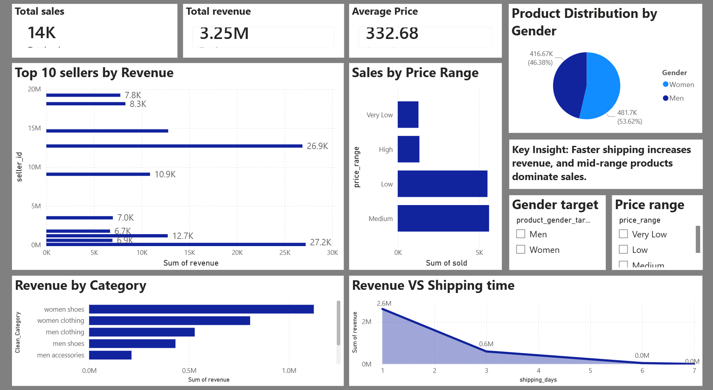

# 🛍️ E-Commerce Sales Analysis Dashboard

## 📌 Project Overview

This project analyzes e-commerce sales data to uncover key business insights related to revenue, seller performance, product categories, and shipping impact.

The project combines **SQL for data processing** and **Power BI for visualization**, resulting in an interactive dashboard that helps understand sales trends and decision-making factors.

---

## 🎯 Objectives

* Analyze overall sales and revenue trends
* Identify top-performing sellers
* Understand category-wise performance
* Study the impact of shipping time on revenue
* Segment products based on price range and gender

---

## 🛠️ Tools & Technologies

* **Python (Pandas, NumPy)** – Data cleaning and preprocessing
* **MySQL** – Data storage, transformation, and querying
* **Power BI** – Dashboard creation and visualization

---

## 🗂️ Dataset

* Source: Vestiaire Collective dataset (cleaned)
* Contains:

  * Product details
  * Seller information
  * Pricing and sales data
  * Shipping details

---

## 🧱 Data Pipeline

### 1. Data Cleaning (Python)

* Removed null and infinite values
* Structured dataset for database insertion

### 2. Database Creation (MySQL)

* Created tables:

  * `products`
  * `sellers`
  * `orders`
* Added primary keys and relationships
* Created calculated column:

  * `revenue = price_usd * sold`

### 3. SQL Analysis

Performed queries for:

* Top sellers by revenue
* Category-wise sales
* Seller performance
* Shipping impact analysis
* Revenue contribution using CTE
* Window functions for ranking

### 4. Views Created

* `seller_revenue` → total revenue per seller
* `category_sales` → total sales per category

---

## 📊 Power BI Dashboard

### Key Visuals:

* 📌 KPI Cards:

  * Total Sales
  * Total Revenue
  * Average Price

* 📊 Charts:

  * Top 10 Sellers by Revenue
  * Revenue by Category
  * Sales by Price Range
  * Revenue vs Shipping Time
  * Product Distribution by Gender

* 🎛️ Filters:

  * Gender
  * Price Range

---

## 💡 Key Insights

* Faster shipping significantly increases revenue
* Mid-range products generate the highest sales
* Certain sellers contribute heavily to total revenue
* Product categories like clothing dominate sales

---

## 📸 Dashboard Preview



---

## 🚀 How to Run the Project

### 1. Clone the repository

```bash
git clone https://github.com/your-username/ecommerce-analysis.git
```

### 2. Load data into MySQL

* Update connection string in Python script
* Run the script to insert data

### 3. Open Power BI

* Connect to MySQL database
* Load tables and views
* Open `.pbix` file

---

## 📁 Project Structure

```
📦 ecommerce-analysis
 ┣ 📂 data
 ┣ 📂 sql
 ┣ 📂 powerbi
 ┣ 📜 import.py
 ┣ 📜 queries.sql
 ┣ 📜 README.md
```

---

## 📌 Future Improvements

* Add customer segmentation
* Include time-based trend analysis
* Enhance dashboard design with advanced visuals

---

## 🙋‍♀️ Author

**Anamika K**

---

## ⭐ If you like this project

Give it a star on GitHub!
